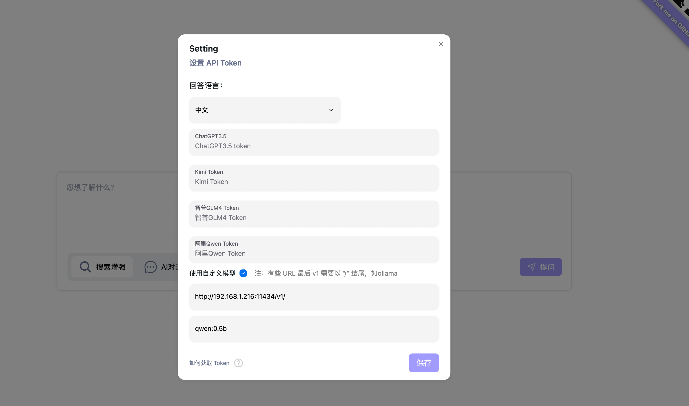

# FreeAskInternet

> Running www.perplexity.ai like app complete FREE, LOCAL, PRIVATE and NO GPU NEED on any computer
> [!IMPORTANT]  
> **If you are unable to use this project normally, it is most likely due to issues with your internet connection or your IP, you need free internet connection to use this project normally. 如果您无法正常使用此项目，很可能是由于您的 IP 存在问题，或者你不能自由访问互联网。**

## What is FreeAskInternet

FreeAskInternet is a completely free, private and locally running search aggregator & answer generate using LLM, Without GPU needed. The user can ask a question and the system will use searxng to make a multi engine search and combine the search result to the ChatGPT3.5 LLM and generate the answer based on search results. All process running locally and  No GPU or OpenAI or Google API keys are needed.

## Features

- 🈚️ Completely FREE (no need for any API keys)
- 💻 Completely LOCAL (no GPU need, any computer can run )
- 🔐 Completely PRIVATE (all thing running locally, using custom llm)
- 👻 Runs WITHOUT LLM Hardware (NO GPU NEED!)
- 🤩 Using Free ChatGPT3.5 / Qwen / Kimi / ZhipuAI(GLM) API (NO API keys need! Thx OpenAI)
- 🐵 Custom LLM(ollama,llama.cpp) support, Yes we love ollama!
- 🚀 Fast and easy to deploy with Docker Compose
- 🌐 Web and Mobile friendly interface, designed for Web Search enhanced AI Chat, allowing for easy access from any device.

## Screenshots

1. index:


2. Search based AI Chat:


3. Multi LLM models and custom LLM like ollama support:


## How It Works?

1. System get user input question in FreeAskInternet UI interface( running locally), and call searxng (running locally) to make search on multi search engine.
2. crawl search result links content and pass to ChatGPT3.5 / Kimi / Qwen / ZhipuAI / ollama (by using custom llm), ask LLM to answer user question based on this contents as references.
3. Stream the answer to Chat UI.
4. We support custom LLM setting, so theoretically infinite llm support.

## Status

This project is still in its very early days. Expect some bugs.

### Run the latest release

```bash
git clone https://github.com/nashsu/FreeAskInternet.git
cd ./FreeAskInternet
docker-compose up -d 
```

🎉 You should now be able to open the web interface on http://localhost:3000. Nothing else is exposed by default.( For old web interface, accessing  http://localhost:3030)

## How to get and set Kimi / Qwen / ZhipuAI Token?

How to get Token?

We are using [https://github.com/LLM-Red-Team](https://github.com/LLM-Red-Team) projects to provide those service, you can reference to their readme.

Reference : [https://github.com/LLM-Red-Team/kimi-free-api](https://github.com/LLM-Red-Team/kimi-free-api)


## How to using custom LLM like ollama? (Yes we love ollama)

1. start ollama serve

```bash
export OLLAMA_HOST=0.0.0.0
ollama serve
```

2. set ollama url in setting:
You MUST using your computer's ip address, not localhost/127.0.0.1, because in docker you can't access this address.
The model name is the model you want to serve by ollama.


ollama model Reference : [https://ollama.com/library](https://ollama.com/library)

### How to update to latest

```bash
cd ./FreeAskInternet
git pull
docker compose down
docker compose rm backend
docker image rm nashsu/free_ask_internet
docker image rm nashsu/free_ask_internet_ui
docker-compose up -d
```

## Credits

- ChatGPT-Next-Web : [https://github.com/ChatGPTNextWeb/ChatGPT-Next-Web](https://github.com/ChatGPTNextWeb/ChatGPT-Next-Web)
- FreeGPT35: [https://github.com/missuo/FreeGPT35](https://github.com/missuo/FreeGPT35)
- Kimi\Qwen\ZhipuAI [https://github.com/LLM-Red-Team](https://github.com/LLM-Red-Team)
- searxng: [https://github.com/searxng/searxng](https://github.com/searxng/searxng)

## License

Apache-2.0 license

## Star History

[](https://star-history.com/#nashsu/FreeAskInternet&Date)
